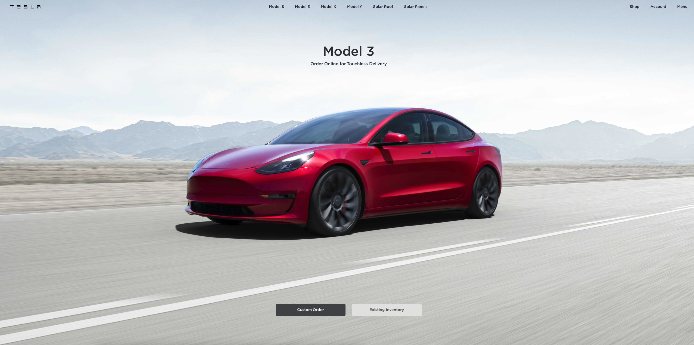

<h1 align="center">
  <br>
  <br>
Tesla Clone
  <br>
</h1>



<p align="center">
  <a href="#technology-used">Technology Used</a> |
  <a href="https://tesla-clone-trdotpy.vercel.app/">Live Demo</a> |
  <a href="#contact">Contact</a> |
  <a href="#license">License</a>
</p>

## Technology Used

This software uses the following open source packages:

- [React](http://electron.atom.io/)
- [TailwindCSS](https://nodejs.org/)

## How To Use

### Using Git

To clone and run this application, you'll need [Git](https://git-scm.com) and [Node.js](https://nodejs.org/en/download/) (which comes with [npm](http://npmjs.com)) installed on your computer. From your command line:

```bash
# Clone this repository
$ git clone https://github.com/trdotpy/tesla-clone

# Go into the repository
$ cd tesla-clone

# Install dependencies
$ npm install

# Run the app
$ npm start
```

## Contact

[Github](https://github.com/trdotpy/) |
[Email](mailto:tanvi.rahman@outlook.com)

## License

MIT
